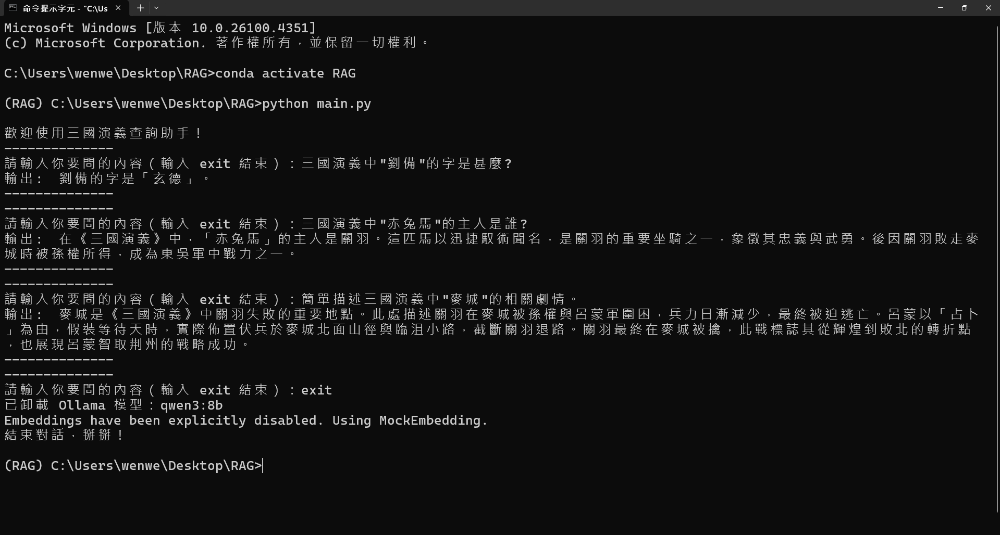

# BookRAG 📜🤖

A Retrieval-Augmented Generation (RAG) system specialized for querying a well-known chinese novel 《三國演義》. Built to let you ask natural-language questions about events, characters, strategies and receive concise, context-aware answers backed by cached text excerpts.

---

## 🚀 Features

- **Local LLM Support**  
  Plug in local model Qwen3 for generation and embedding.

- **📚 LlamaIndex Integration**  
  Utilize LlamaIndex for fast document ingestion, vector indexing, and flexible query engines.
---

## 🛠 Demo

## References

